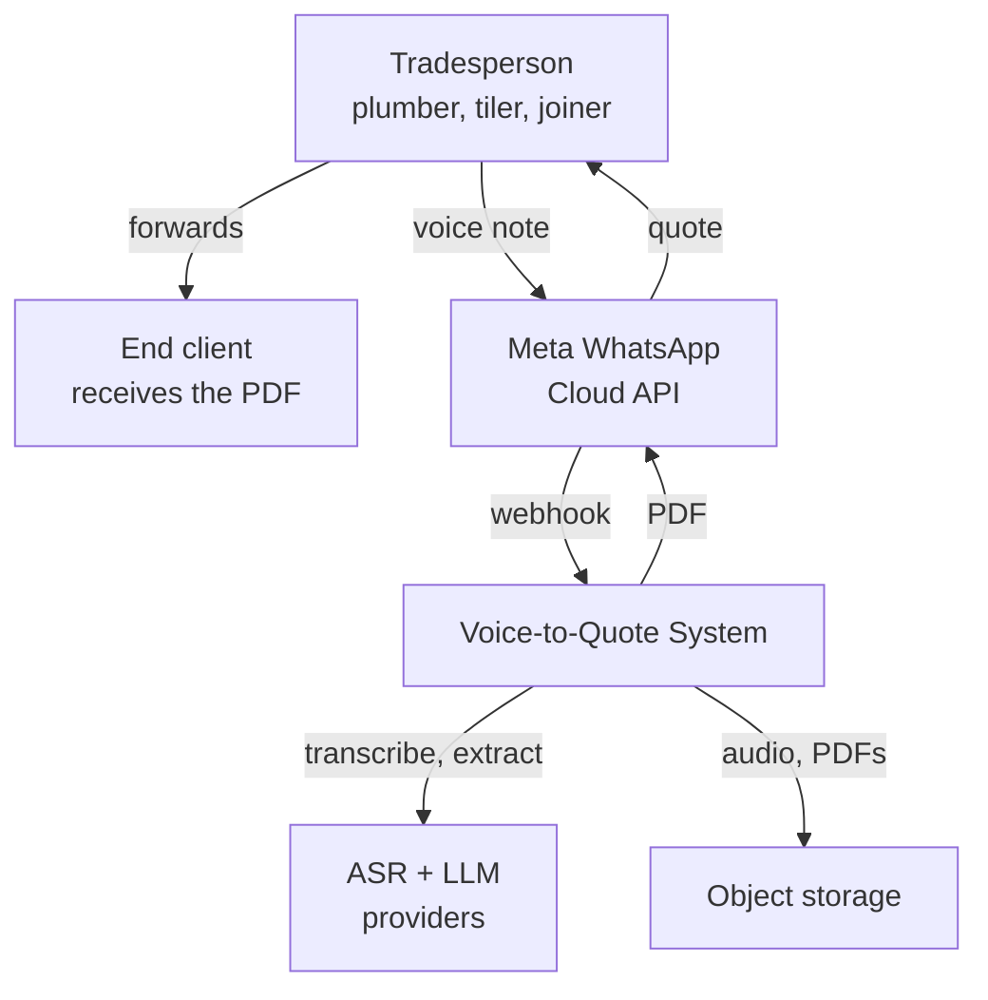
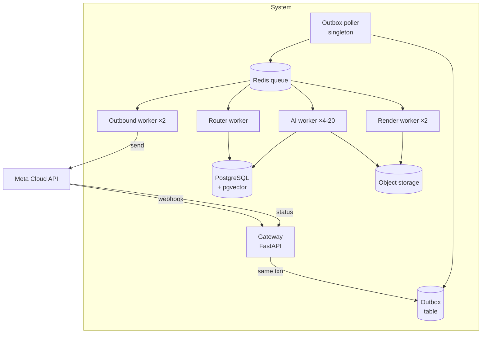
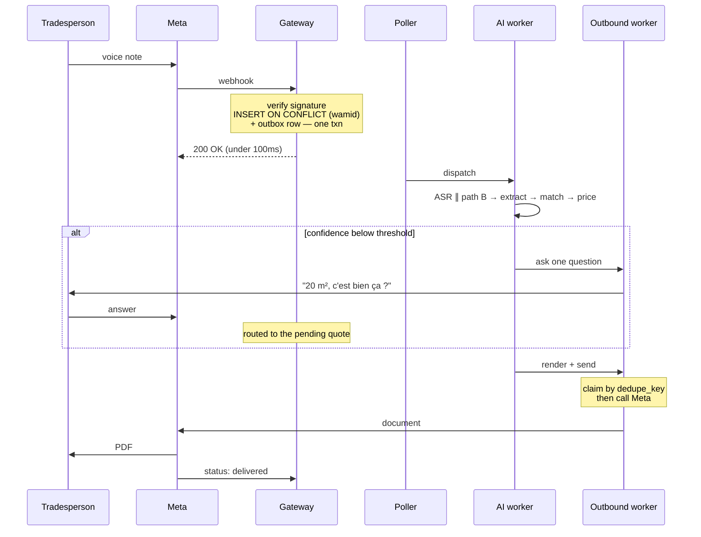
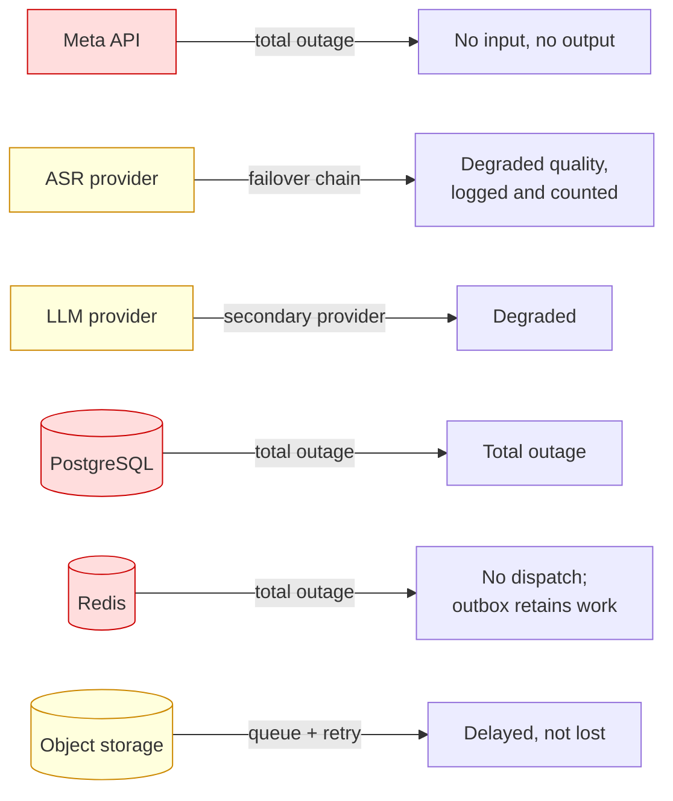
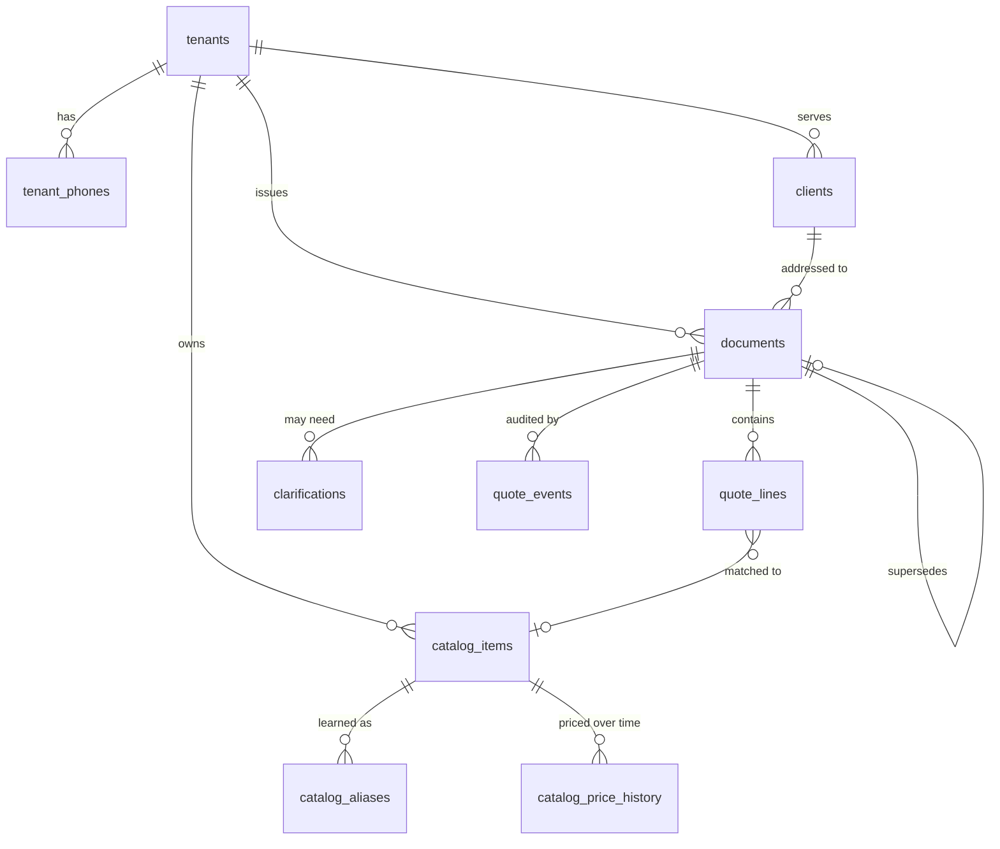

# Architecture v3.1 — Object design, patterns and diagrams

**Status:** v3.1 · **Date:** 28 August 2026
**Relationship:** additive to v2 and v3. Covers the object-design and modelling
questions the previous passes skipped entirely.

---

## What was actually missing

v2 and v3 covered structure, guarantees and operations. They said almost nothing about **how objects are composed**, and nothing at all about several modelling questions that produce bugs no test suite is aimed at.

| § | Gap | Consequence if left |
|---|---|---|
| K | No dependency wiring strategy | Module-level singletons; tests that depend on import order |
| L | Primitive obsession | `quantity: Decimal` and `unit: str` allow adding 20 m² to 3 units |
| M | No aggregate boundaries | Transactions spanning unrelated data; lock contention |
| N | Compensations undefined | Orphaned PDFs and half-applied catalog writes |
| O | Concurrency model unstated | `ffmpeg` and Playwright blocking the event loop |
| P | Model determinism unstated | Evals that cannot reproduce, temperature drift |
| **Q** | **Time zone** | **Morocco changes offset on 20 September 2026 — three weeks out** |
| R | Patterns unnamed | Reinvention, and no shared vocabulary in review |
| S | Diagrams ad hoc | ASCII sketches that drift from the code silently |

Start with §Q. It has a date on it.

---

## §Q — Time, and an imminent operational hazard

*Insert as §13.3.*

### Q.1 The change

Morocco has run on permanent UTC+1 since October 2018, reverting to UTC+0 for the month of Ramadan — <cite index="60-1">the only country in the world with a religious observance formally embedded in its time zone rules</cite>.

That is ending. <cite index="55-1">Citing complaints about dark mornings and public safety, the government reversed the permanent-DST decree and returns the country to permanent standard time from autumn 2026, which also eliminates the annual Ramadan clock change.</cite> <cite index="61-1">The switch date is 20 September 2026</cite> — roughly three weeks from now, and inside the build window.

### Q.2 Why this matters here

The system computes several things in local terms:

- `valid_until` — a **date**, printed on a legal-ish commercial document
- "sent 3 days ago" — the follow-up scan
- `expires_at` on clarifications — 24 hours
- "this month" — the margin query

A one-hour offset shift moves a boundary. A follow-up scheduled for "3 days after 09:00" fires at 08:00 or 10:00 depending on which side of the change it was computed. Worse, a `valid_until` computed as `now() + 30 days` in local time and stored as a `DATE` can land on the wrong day.

### Q.3 The rules

**Store instants in UTC, always.** `TIMESTAMPTZ` (already specified in v2 §4) stores UTC internally. Never store a naive `TIMESTAMP`.

**Convert at the edges, never in the middle.** Business logic works in UTC. Only rendering and user-facing copy convert to `Africa/Casablanca`.

**Compute date boundaries in the tenant's zone, then convert.** "Valid for 30 days" means 30 calendar days as the tradesperson experiences them:

```python
from zoneinfo import ZoneInfo
CASABLANCA = ZoneInfo("Africa/Casablanca")

def valid_until(issued_at_utc: datetime, days: int) -> date:
    local = issued_at_utc.astimezone(CASABLANCA)
    return (local + timedelta(days=days)).date()
```

**Never do arithmetic on local times.** `local + timedelta(days=3)` crossing an offset change gives the wrong instant. Convert to UTC, add, convert back.

**Keep `tzdata` current.** The offset change ships as a tzdata release. Pin `tzdata` as an explicit dependency and update it — a container built before the release and deployed after it will silently use the old rule.

```
# pyproject.toml
tzdata = ">=2026.2"          # must include the Morocco 2026 change
```

Add a test that fails loudly if the environment's tzdata is stale:

```python
def test_tzdata_knows_morocco_2026_change():
    before = datetime(2026, 9, 1, 12, tzinfo=ZoneInfo("Africa/Casablanca"))
    after  = datetime(2026, 10, 1, 12, tzinfo=ZoneInfo("Africa/Casablanca"))
    assert before.utcoffset() != after.utcoffset(), \
        "tzdata predates the September 2026 Morocco change — upgrade tzdata"
```

This is exactly the sort of test that looks like paranoia until the week it fires.

### Q.4 Verify before relying on it

The date and details come from reporting, and government time decrees have moved before. Confirm against the official decree before the build depends on it, and re-check nearer the date.

---

## §K — Dependency injection without a framework

*Insert as §3.2.*

v2 defines Protocols but never says how instances reach the code that uses them. The default Python answer — a module-level client — is the wrong one:

```python
# app/adapters/llm/client.py
client = anthropic.AsyncAnthropic(api_key=settings.KEY)   # ← constructed at import
```

Importing anything transitively constructs a real client. Tests become import-order dependent, `PROVIDER_MODE=fake` stops meaning anything, and swapping a provider requires monkeypatching.

### K.1 Do not add an IoC container

`dependency-injector`, `punq` and friends solve a problem Python does not have. There is no compile-time wiring to replace and no interface-to-implementation registry needed — Protocols are structural, so any object with the right shape satisfies them.

What is needed is one **composition root**: a single place that builds the object graph, and constructor injection everywhere else.

### K.2 The container is a dataclass

```python
# app/composition.py — the only module that constructs adapters
@dataclass(frozen=True)
class Container:
    settings:  Settings
    clock:     Clock
    db:        AsyncEngine
    redis:     Redis
    messaging: MessagingProvider
    asr:       ASRProvider
    llm:       LLMProvider
    storage:   StorageProvider
    renderer:  Renderer

def build(settings: Settings) -> Container:
    fake = settings.PROVIDER_MODE == "fake"
    return Container(
        settings=settings,
        clock=SystemClock(),
        db=create_async_engine(settings.DATABASE_URL,
                               pool_size=POOL_SIZE[settings.ROLE],
                               connect_args={"statement_cache_size": 0}),
        redis=Redis.from_url(settings.REDIS_URL),
        messaging=FakeMessaging() if fake else MetaCloudProvider(settings),
        asr=FakeASR() if fake else ASRWithFailover(build_asr_chain(settings)),
        llm=FakeLLM() if fake else InstructorClient(settings),
        storage=LocalStorage() if fake else S3Storage(settings),
        renderer=PlaywrightRenderer(BrowserPool()),
    )
```

Every entrypoint calls `build()` exactly once at startup and passes the container down. Nothing else constructs an adapter, and `grep -rn "MetaCloudProvider(" app/` returning one hit is the invariant.

### K.3 Services take what they need, not the container

```python
# wrong — depends on everything, untestable in isolation
class QuoteService:
    def __init__(self, container: Container): ...

# right — the signature documents the dependencies
class QuoteService:
    def __init__(self, asr: ASRProvider, llm: LLMProvider,
                 catalog: CatalogRepository, clock: Clock) -> None:
        self._asr, self._llm, self._catalog, self._clock = asr, llm, catalog, clock
```

Passing the container is a **service locator**, and it is the anti-pattern the composition root exists to avoid: the class no longer declares what it uses, so nothing stops a dependency being added invisibly, and every test must build a full container.

A constructor growing past five dependencies is the signal that the class is doing too much — a useful design pressure that a container hides.

### K.4 Wiring the two entrypoints

```python
# HTTP — FastAPI's Depends, at the route layer only
def get_container(request: Request) -> Container:
    return request.app.state.container

@router.post("/webhooks/whatsapp")
async def receive(request: Request, c: Container = Depends(get_container)):
    ...
```

```python
# Workers — arq context, built once
async def startup(ctx: dict) -> None:
    ctx["c"] = build(Settings())

async def process_quote(ctx: dict, quote_id: str) -> None:
    c: Container = ctx["c"]
    svc = QuoteService(c.asr, c.llm, CatalogRepository(c.db), c.clock)
    await svc.run(UUID(quote_id))
```

`Depends` is a routing convenience, not the DI strategy. Keeping it at the route layer stops FastAPI leaking into the domain, which matters the day part of this runs outside HTTP.

---

## §L — Value objects: the unit bug waiting to happen

*Insert as §13.4.*

v2 models a line as `quantity: Decimal` plus `unit: str`. Nothing stops this:

```python
total = line_a.quantity + line_b.quantity     # 20 m² + 3 units = 23 ???
price = quantity * unit_price                 # which unit? m² price × ml quantity?
```

The type system is silent because both sides are `Decimal`. In a system whose single most dangerous failure is a wrong number on a document, that is the wrong place to be silent.

### L.1 Quantity carries its unit

```python
# app/domain/values.py — pure, frozen, no I/O
@dataclass(frozen=True, slots=True)
class Quantity:
    amount: Decimal
    unit: Unit

    def __add__(self, other: "Quantity") -> "Quantity":
        if self.unit != other.unit:
            raise IncompatibleUnits(f"{self.unit} + {other.unit}")
        return Quantity(self.amount + other.amount, self.unit)

    def price_at(self, rate: "Money", rate_unit: Unit) -> "Money":
        if rate_unit != self.unit:
            raise IncompatibleUnits(f"rate is per {rate_unit}, quantity is {self.unit}")
        return rate * self.amount
```

The mismatch now raises where it happens, with the two units named, instead of producing a plausible wrong total that reaches a client.

### L.2 Money is not a Decimal

```python
@dataclass(frozen=True, slots=True)
class Money:
    amount: Decimal              # always already quantised to the centime
    currency: str = "MAD"

    def __post_init__(self):
        object.__setattr__(self, "amount",
                           self.amount.quantize(CENTS, rounding=ROUND_HALF_UP))

    def __mul__(self, factor: Decimal) -> "Money":
        return Money(self.amount * factor, self.currency)

    def __add__(self, other: "Money") -> "Money":
        if self.currency != other.currency:
            raise CurrencyMismatch(...)
        return Money(self.amount + other.amount, self.currency)

    def apply_rate(self, pct: Decimal) -> "Money":       # VAT, discount
        return Money(self.amount * pct / 100, self.currency)
```

Rounding happens in `__post_init__`, so RC-1 and RC-5 are enforced by construction rather than by remembering to call `q2()`. A `Money` that is not correctly rounded cannot exist.

`Money * Money` is deliberately not defined — it is meaningless, and its absence catches a real class of mistake.

### L.3 The others worth having

| Type | Prevents |
|---|---|
| `PhoneE164` | inconsistent formats as dict keys and lookup misses |
| `TenantId = NewType("TenantId", UUID)` | passing a `client_id` where a `tenant_id` belongs |
| `VatRate` | `0.20` and `20.00` being confused |
| `Unit` (enum) | `"m2"` vs `"m²"` vs `"M2"` |

`NewType` costs nothing at runtime and mypy catches the swap. UUIDs are the easiest arguments in the codebase to transpose, and the failure is silent.

### L.4 Where they live

Value objects are `domain/`, so they are pure by construction. Adapters convert at the boundary: the database stores `NUMERIC` and `TEXT`, SQLAlchemy type decorators map to and from `Money` and `Quantity`. Primitives at the edges, value objects inside.

---

## §M — Aggregates and transaction boundaries

*Insert as §4.9.*

Which rows must change together, and which merely often do? v2 never says, so transactions will be drawn by habit and grow.

### M.1 Three aggregates

| Aggregate | Root | Inside | Consistency rule |
|---|---|---|---|
| **Document** | `documents` | `quote_lines`, `clarifications`, `quote_events` | totals always match lines |
| **Catalog** | `catalog_items` | `catalog_aliases`, `catalog_price_history` | a price change is atomic with its history row |
| **Conversation** | `conversation_sessions` | `intent_decisions` | routing pointer is consistent |

`tenants`, `clients`, `outbox`, `outbound_messages` and `usage_events` are not aggregates — they are independently mutable records.

### M.2 One transaction, one aggregate

Matching wants to write both a document line and a new catalog alias. Those are two aggregates, so:

```python
# wrong — one transaction across two aggregates
async with tenant_session(engine, tid) as s:
    await save_lines(s, quote_id, lines)
    await create_aliases(s, learned)         # different aggregate

# right — the document is the consistency requirement; the alias is not
async with tenant_session(engine, tid) as s:
    await save_lines(s, quote_id, lines)
    s.add(Outbox(job_name="learn_aliases",
                 payload={"tenant_id": str(tid), "aliases": learned}))
```

Two payoffs. The document transaction stays short, which matters directly for §F.1's connection pressure. And alias learning failing cannot roll back a correctly matched quote — the learning is an optimisation, the quote is the product.

The rule of thumb: **if the second write failing should not undo the first, they belong to different aggregates.**

### M.3 References across aggregates are by id

`quote_lines.catalog_item_id` is an id, and `unit_price_ht` is a snapshot alongside it (v2 §4.5). This is what makes a March quote still print March's price in June. It is the aggregate rule and the snapshot rule turning out to be the same rule, which is usually a sign both are right.

---

## §N — The pipeline is a saga

*Insert as §6.6.*

v2's pipeline is a distributed transaction across a database, an object store and three external APIs. It cannot be atomic. v2 defines the forward path carefully and never asks what undoes a partial one.

### N.1 Steps, and what compensates them

| Step | Compensation | Notes |
|---|---|---|
| Media stored | delete after retention | none needed at failure time |
| Transcript saved | none | keep it; retry reuses it via the cache |
| Lines matched | none | keep; a revision reuses them |
| Aliases learned | none | harmless if the quote later fails |
| Number assigned | **none — accept the gap** | gapless was deliberately rejected (§14.1) |
| PDF rendered | delete on permanent send failure | otherwise an orphan accumulates |
| **Message sent** | **none — irreversible** | this is the commit point |

Two conclusions worth stating explicitly, because they are not obvious:

**Most steps need no compensation** — they are additive and idempotent, and retaining them makes retry cheaper. Compensation logic is usually over-applied.

**The send is the commit point.** Everything before it is provisional; nothing after it can be undone. That is why `AmbiguousOutcome` (§B) is never retried: it is the one step where "did it happen?" cannot be answered locally, and it is precisely the irreversible one.

### N.2 Orphan cleanup

```python
async def cleanup_orphans(clock: Clock) -> None:
    """A rendered PDF whose document never reached 'sent' after 24h."""
    for doc in await find_rendered_never_sent(older_than=clock.now() - timedelta(days=1)):
        await storage.delete(doc.pdf_key)
        await mark(doc, pdf_key=None)
```

Small, and the alternative is an object store that grows monotonically with every failed send.

### N.3 Naming it

This is an **orchestration saga**, not choreography: the worker drives the sequence explicitly rather than steps reacting to each other's events. That is the right choice at this size — choreography's decoupling buys nothing with one service and costs the ability to read the flow in one file.

Worth recording as an ADR, because "why is this not event-driven" is a question that will be asked.

---

## §O — Concurrency model

*Insert as §3.3.*

The whole system is `asyncio`, and two of its heaviest operations are not async. v2 never mentions this, and the failure mode is invisible until load.

### O.1 The hazard

```python
# blocks the event loop for ~800 ms — every other coroutine in the
# process stalls, including webhook ACKs if this shares a process
subprocess.run(["ffmpeg", "-i", src, dst])
```

One blocked worker means every concurrent quote in that worker stalls. The symptom is p99 latency with no obvious slow component, which is a miserable thing to debug.

### O.2 The rules

**Subprocesses use the async API:**

```python
proc = await asyncio.create_subprocess_exec(
    "ffmpeg", "-i", src, "-ar", "16000", "-ac", "1", dst,
    stdout=asyncio.subprocess.DEVNULL, stderr=asyncio.subprocess.PIPE)
_, err = await asyncio.wait_for(proc.communicate(), timeout=dl.budget_for("transcode", 3))
if proc.returncode != 0:
    raise AudioUnusable(err.decode()[:200])
```

**Playwright: use the async API** (`playwright.async_api`). The sync API inside an async worker blocks the loop for the entire render.

**CPU-bound work goes to an executor.** Little qualifies here — hashing a 200 KB audio file is microseconds — but if embedding ever moves in-process, it needs `run_in_executor`.

**Never call a blocking DB or HTTP library.** `asyncpg` via SQLAlchemy async, `httpx.AsyncClient`. One `requests.get` stalls everything.

### O.3 Bound the concurrency

`asyncio` will happily start 500 coroutines and exhaust the connection pool. Semaphores per resource, sized to the pool:

```python
SEMAPHORES = {
    "db":     asyncio.Semaphore(POOL_SIZE[ROLE]),
    "asr":    asyncio.Semaphore(4),      # provider rate limit
    "render": asyncio.Semaphore(2),      # Chromium memory
}
```

### O.4 A guard worth having

`asyncio` debug mode logs any callback exceeding a threshold. Enable it in staging:

```python
loop.set_debug(True)
loop.slow_callback_duration = 0.2      # log anything blocking >200ms
```

This finds accidental blocking calls before they reach production, which is the only time they are cheap to find.

---

## §P — Determinism in model calls

*Insert as §10.6.*

v3 made the clock and ids injectable for test determinism, then left the least deterministic component untouched.

### P.1 Extraction is not creative writing

```python
EXTRACTION_PARAMS = {"temperature": 0.0, "top_p": 1.0, "max_tokens": 2000}
```

Temperature zero for extraction, classification and catalog capture. There is one correct answer to "how many square metres did they say"; sampling variety only adds variance to the eval scores and makes a regression indistinguishable from noise.

This is not full determinism — batching and hardware still introduce variation — but it removes the largest controllable source.

### P.2 Cache keys must include everything that changes the output

```python
key = f"extract:{sha256(transcript)}:{prompt_version}:{model_id}:{params_hash}"
```

v3 included the prompt version. The model id and parameters belong there too — otherwise a model swap serves stale results from the old model, which looks exactly like a change that failed to deploy.

### P.3 Record the full call context on the row

`documents` already stores `prompt_version` and `asr_provider`. Add `model_id` and `params_hash`. When a quality question arrives three weeks later, these four columns are the difference between an answer and a guess.

---

## §R — Pattern catalogue

*Insert as an appendix.*

Naming what is already in use, so review has shared vocabulary and nobody reinvents it under a different name.

### R.1 In use

| Pattern | Where | Why it is right here |
|---|---|---|
| **Ports & Adapters (hexagonal)** | the whole layering | this *is* the architecture; `domain/` purity is the port boundary |
| **Transactional Outbox** | §8.1 | the only correct answer to dual writes without 2PC |
| **Circuit Breaker** | §D.3 | shared Redis state, transient-only tripping |
| **Strategy** | ASR chain, `DocumentSpec` | swap behaviour by configuration, not by branching |
| **Chain of Responsibility** | routing cascade, matching cascade | ordered fallbacks, cheapest first |
| **State machine as data** | `TRANSITIONS` | a dict beats a class-per-state at 14 states |
| **Repository** | `db/repositories/` | keeps SQLAlchemy out of services |
| **Null Object** | `FakeProvider` | offline dev without `if fake:` scattered everywhere |
| **Builder** | test data (§H.2) | readable tests |
| **Value Object** | §L | unit and currency safety |
| **Saga (orchestration)** | §N | explicit sequence, readable in one file |
| **Composition Root** | §K | one place constructs; everything else is injected |

### R.2 Deliberately rejected

| Pattern | Why not |
|---|---|
| **Service Locator** | passing the container hides dependencies and makes every test build the world |
| **Active Record** | couples the domain to the ORM and destroys `domain/` purity |
| **Generic `Repository<T>`** | leaks a query language into services; write the three methods actually needed |
| **Abstract base class for one implementation** | Protocols are structural; an ABC with one subclass is ceremony |
| **Singleton** | a module-level instance is an untestable global with better PR |
| **Deep inheritance** | composition, plus Protocols. Inheritance is for exception hierarchies here and nowhere else |
| **CQRS** | one model, one database, no read/write asymmetry to exploit |
| **Event sourcing** | `quote_events` gives the audit trail without rebuilding state from a log |
| **Mediator / in-process event bus** | indirection that hides the call graph in a system small enough to read |
| **Decorator chains for cross-cutting concerns** | explicit `@observe` and `meter()` calls are easier to follow than a stack of wrappers |

The second table matters more than the first. The chosen patterns are visible in the code; the rejected ones are what someone will propose again next quarter.

---

## §S — Diagrams

*Insert as §29, with sources in `docs/diagrams/`.*

v2's ASCII sketches drift from the code silently. Commit Mermaid to the repo, render in CI, and link from the README. Five diagrams, not more — an unmaintained diagram is worse than none because it is believed.

### S.1 C4 Level 1 — context



### S.2 C4 Level 2 — containers



### S.3 Sequence — the async path with its two idempotency points



### S.4 Blast radius — the diagram nobody draws

What is unavailable when a dependency is. This is the one that changes decisions.



Two things fall out of drawing it. Redis being critical for *dispatch* but not for *durability* — because the outbox holds the work — is a property worth knowing during an incident. And Meta is the only single point of failure with no technical mitigation, which is why §24's second pre-approved number is the answer.

### S.5 ER — the core



### S.6 Keeping them honest

```yaml
# .github/workflows/ci.yml
- name: render diagrams
  run: npx -y @mermaid-js/mermaid-cli -i docs/diagrams/*.mmd -o docs/diagrams/
- name: fail if diagrams are stale
  run: git diff --exit-code docs/diagrams/
```

Syntax errors fail the build, and a regenerated SVG that differs from the committed one means someone edited a diagram without committing the render. Neither check verifies the diagram matches the code — nothing can — but a diagram that at least parses and is current is a much lower bar to clear than the one v2 was failing.

---

## Priority

Only two of these have deadlines.

| | Item | When | Why |
|---|---|---|---|
| 1 | **§Q time zone** | this week | the offset changes on 20 September 2026 |
| 2 | **§K composition root** | before the second adapter | retrofitting means touching every import |
| 3 | §L value objects | week 3–4, with the pricing engine | cheap now, invasive later |
| 4 | §O async hazards | week 3–4, with ffmpeg and Playwright | avoid, do not fix |
| 5 | §M aggregates, §N saga | week 5 | as transactions get drawn |
| 6 | §P determinism | week 5, with the eval harness | eval variance depends on it |
| 7 | §S diagrams | week 6 | after the shape has settled |
| 8 | §R catalogue | ongoing | a review artifact, not a build task |
